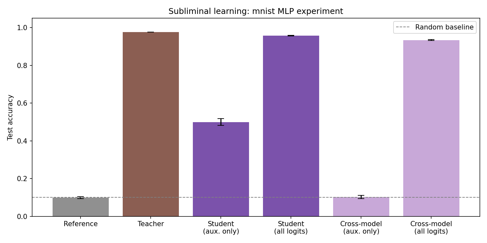

# Subliminal Learning

An implementation of vision experiments based on the Anthropic [Subliminal Learning](https://arxiv.org/abs/2507.14805) paper in PyTorch.

A student trained only on noise images to imitate a teacher's auxiliary logits achieves >50% accuracy on MNIST, despite never seeing labelled data.



## Setup

Requires [uv](https://docs.astral.sh/uv/).

```bash
uv sync --dev
```

## Running

Logs to wandb by default. Pass `--no-wandb` to disable it, or run `wandb offline` to store the data locally.

```bash
# Full 100-seed experiment (batched across seeds, ~2 min on GPU, ~8 GB VRAM)
uv run python run_experiment.py

# Fashion-MNIST variant
uv run python run_experiment.py --dataset fashion-mnist

# CIFAR-10 with CNN (stronger teacher, ~75% vs ~55% for MLP)
uv run python run_experiment.py --dataset cifar-10 --arch cnn

# Quick sanity check (5 seeds)
uv run python run_experiment.py --n-seeds 5

# Per-epoch loss/accuracy
uv run python run_experiment.py --verbose
```

Output is saved to `results/{dataset}_{arch}_t{n_epochs_teacher}_s{n_epochs_student}_a{n_aux}.png` (and a matching `.json` config).

## Sweeps

```bash
wandb sweep sweep.yaml
wandb agent <sweep_id>
```

Edit `sweep.yaml` to configure the parameter grid and search method. Sweepable parameters include `dataset`, `n-epochs-teacher`, `n-epochs-student`, and `n-aux`.

## Development

```bash
# Tests
uv run pytest

# Lint
uv run ruff check .

# Format
uv run ruff format .

# Typecheck
uv run pyright
```

## References

Paper:
* [Subliminal Learning: Language Models Transmit Behavioral Traits via Hidden Signals in Data](https://arxiv.org/abs/2507.14805)
